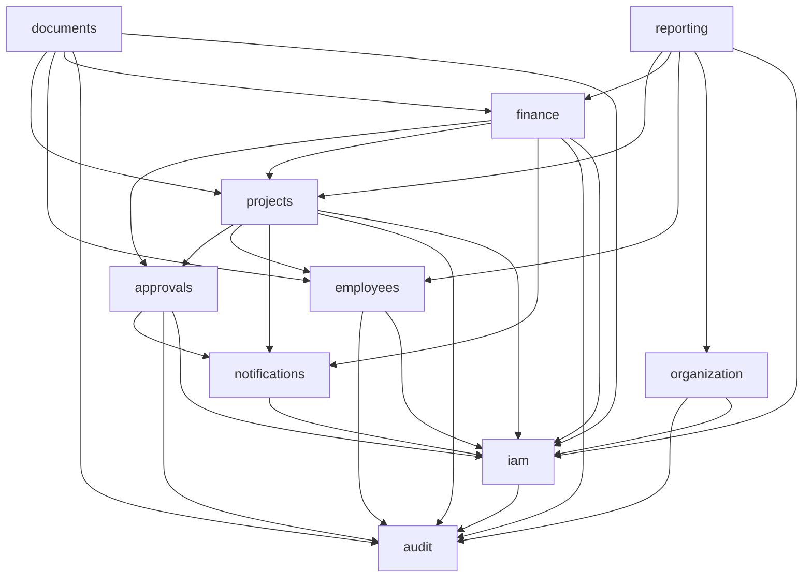

# ARCHITECTURE — Construction ERP (MVP)

**Status:** Draft for Technical Approval
**Style:** Modular Monolith · Clean Architecture (pragmatic) · Feature-Sliced Design on the frontend
**Runtime:** Next.js 15 (App Router) · TypeScript strict · Node.js runtime on Vercel

---

## 1. Architecture Overview

One deployable Next.js application containing clearly separated business modules. The UI, the application logic, and the data access live in the same process but **not** in the same layer — boundaries are enforced by folder structure, import rules (ESLint), and typed module public APIs.

```
┌──────────────────────────────────────────────────────────────────────┐
│                          Browser (AR-RTL / EN-LTR)                   │
│      React Server Components · Client Components · shadcn/ui         │
└──────────────────────────────┬───────────────────────────────────────┘
                               │ HTTPS
┌──────────────────────────────▼───────────────────────────────────────┐
│                      Next.js App Router (Vercel)                     │
│                                                                      │
│  ┌── Presentation ──────────────────────────────────────────────┐    │
│  │  app/[locale]/(dashboard)/...  RSC pages, layouts             │    │
│  │  widgets/ · features/ · entities/ · shared/ui   (FSD)         │    │
│  └───────────────────────────┬──────────────────────────────────┘    │
│                              │ Server Actions / Route Handlers        │
│  ┌── Application ────────────▼──────────────────────────────────┐    │
│  │  src/modules/<module>/application                             │    │
│  │  use-cases · Zod schemas · authorization guard · tx boundary  │    │
│  └───────────────────────────┬──────────────────────────────────┘    │
│  ┌── Domain ─────────────────▼──────────────────────────────────┐    │
│  │  src/modules/<module>/domain                                  │    │
│  │  pure business rules · invariants · money & date policy       │    │
│  └───────────────────────────┬──────────────────────────────────┘    │
│  ┌── Infrastructure ─────────▼──────────────────────────────────┐    │
│  │  Prisma repositories · Better Auth · Vercel Blob · audit sink │    │
│  └───────────────────────────┬──────────────────────────────────┘    │
└──────────────────────────────┼───────────────────────────────────────┘
                               │
        ┌──────────────────────┼──────────────────────┐
        ▼                      ▼                      ▼
  PostgreSQL (Neon)      Vercel Blob            Vercel Logs
  business + audit       private files          observability
```

**Dependency rule:** Presentation → Application → Domain. Infrastructure implements interfaces declared by Application/Domain. Nothing in Domain imports Prisma, Next.js, or React.

---

## 2. Modules and Boundaries

| Module | Owns (tables) | Responsibility |
|---|---|---|
| `iam` | `User`, `Session`, `Account`, `Verification` | Authentication, roles, session context, permission evaluation |
| `organization` | `CompanySetting`, `Department`, `Client` | Company-wide configuration and shared reference data |
| `projects` | `Project`, `ProjectAssignment` | Project lifecycle, manager assignment, staffing |
| `finance` | `Expense`, `Income`, `ExpenseCategory`, `IncomeCategory` | Financial transactions and classification |
| `approvals` | `ApprovalRequest` | Approval state machine for large expenses and budget changes |
| `employees` | `Employee` | Workforce profiles and employment data |
| `documents` | `Document` | File metadata, upload/download authorization |
| `notifications` | `Notification` | In-app notification creation and reading |
| `audit` | `AuditLog` | Append-only recording of sensitive actions |
| `reporting` | none (read-only) | Cross-module aggregates, exports (Excel/PDF) |

### 2.1 Allowed dependencies



Rules:
1. **No cycles.** `audit`, `notifications`, and `iam` are leaf/shared modules; they never import a business module.
2. A module is consumed **only through its public API** (`src/modules/<module>/index.ts`). Deep imports are blocked by ESLint `no-restricted-imports`.
3. A module may read another module's tables **only** via that module's exported query services — never by importing its Prisma delegate directly.
4. `reporting` is read-only: it may query, never mutate.
5. Cross-module invariants that must be atomic (e.g. approve budget change → update project budget) are coordinated by an **application-layer transaction script** that receives a single Prisma transaction client and passes it to each module's repository.

### 2.2 Module internal shape

```
src/modules/finance/
├── domain/                 # pure TS: entities, value objects, rules. No IO.
│   ├── expense.rules.ts
│   ├── money.ts
│   └── errors.ts
├── application/            # use cases, orchestration, Zod schemas, ports
│   ├── schemas/
│   ├── use-cases/
│   └── ports/              # RepositoryPort interfaces
├── infrastructure/         # Prisma repositories implementing ports
│   └── prisma-expense.repository.ts
└── index.ts                # public API (types + use case entry points)
```

Why this is *pragmatic* DDD: entities are plain typed objects plus rule functions, not heavyweight class hierarchies. We keep the valuable parts — ubiquitous language, invariants in one place, isolation from infrastructure — and skip aggregates-as-classes, event sourcing, and CQRS, which YAGNI at this scale.

---

## 3. Request Lifecycle

Every mutation follows the same six steps. This is the single most important convention in the codebase.

```
Client component (RHF + Zod resolver)
        │ 1. optimistic client-side validation
        ▼
Server Action  "use server"
        │ 2. getSessionContext()            → 401 if absent
        │ 3. assertPermission(ctx, perm, scope) → 403 + PERMISSION_DENIED audit
        │ 4. schema.parse(rawInput)         → typed input, 422 on failure
        ▼
Use case (application layer)
        │ 5. domain rules + prisma.$transaction:
        │      mutate → write AuditLog → enqueue Notification
        ▼
Result<T>  (never throws across the boundary)
        │ 6. revalidatePath / revalidateTag
        ▼
UI renders success, field errors, or a safe error message
```

**Result type** — errors are values, not exceptions:

```ts
export type Result<T> =
  | { ok: true; data: T }
  | { ok: false; error: AppError };

export type AppError = {
  code: 'UNAUTHENTICATED' | 'FORBIDDEN' | 'VALIDATION' | 'NOT_FOUND'
      | 'CONFLICT' | 'RULE_VIOLATION' | 'INTERNAL';
  messageKey: string;              // i18n key, rendered client-side
  fieldErrors?: Record<string, string[]>;
};
```

Internal exception details are logged server-side and never returned to the client (OWASP A09).

---

## 4. Authentication and Authorization

### 4.1 Authentication (Better Auth)

- Email + password with the Better Auth Prisma adapter; `Session`, `Account`, `Verification` tables live in the same database.
- Session cookie: `httpOnly`, `secure`, `sameSite=lax`, rolling expiry.
- `isActive = false` blocks sign-in and invalidates existing sessions.
- Login success/failure and logout are written to `AuditLog` (`LOGIN_SUCCEEDED`, `LOGIN_FAILED`, `LOGGED_OUT`) without ever logging credentials.
- Rate limiting on auth endpoints (per IP + per email) to mitigate credential stuffing.

### 4.2 Authorization model

Permissions are **derived from role**, not stored per user (no custom roles in the MVP — PRD §5.1). A static, typed matrix maps role → permission set; see `RBAC-MATRIX.md`.

```ts
type Permission = `${Module}.${Resource}.${Action}`;   // e.g. 'finance.expense.approve'

type SessionContext = {
  userId: string;
  role: UserRole;
  employeeId: string | null;
  locale: Locale;
};
```

Two enforcement layers:

1. **Coarse (permission):** `assertPermission(ctx, 'projects.project.update')`.
2. **Fine (scope/ownership):** a scope resolver answers row-level questions, e.g. a `PROJECT_MANAGER` may act only on projects where `projectManagerId = ctx.userId`; an `EMPLOYEE` may read only the `Employee` row linked to their user.

Scope is applied as a **query filter**, not a post-fetch check, so unauthorized rows are never loaded:

```ts
const where = withProjectScope(ctx, { deletedAt: null });
// PROJECT_MANAGER → { deletedAt: null, projectManagerId: ctx.userId }
```

Middleware only guards route *reachability* and locale routing. **Authorization is always re-checked in the Server Action** — the middleware is a UX convenience, never the security boundary (OWASP A01).

### 4.3 Flow

```
Request → middleware (locale + session cookie presence)
        → RSC layout: getSessionContext() → redirect to /sign-in when missing
        → page renders only permitted widgets (usePermission / <Can>)
        → Server Action: getSessionContext + assertPermission + scope filter
        → denial → AuditLog(PERMISSION_DENIED) + generic error message
```

---

## 5. File Upload and Download

Files never transit the server as buffers; the server issues a scoped client upload token, then records metadata.

```
Upload
 1. Client requests an upload token from a Server Action
      → authorization on the OWNING entity (e.g. projects.project.update)
      → server validates ownerType/ownerId, documentType, mimeType, declared size
 2. Server returns a Vercel Blob client token restricted to a server-generated
    storageKey:  {ownerType}/{ownerId}/{cuid}.{ext}
      → user-supplied filenames are stored as metadata only, never as a path
 3. Browser uploads directly to Vercel Blob
 4. onUploadCompleted callback (or confirm action) creates the Document row
    + AuditLog(FILE_UPLOADED)

Download
 1. GET /api/documents/:id/download   (Route Handler, not a Server Action —
    binary streaming and Content-Disposition need a real HTTP response)
 2. Load Document → resolve owning entity → assertPermission + scope
 3. Deny → 404 (not 403) to avoid leaking existence
 4. Allow → short-lived signed blob URL or streamed response
    + AuditLog(FILE_DOWNLOADED) for confidential types
```

Controls: MIME allow-list (`pdf`, `png`, `jpeg`, `webp`, `docx`, `xlsx`), size caps (10 MB general, 25 MB photos/drawings), extension/MIME agreement check, `Content-Disposition: attachment`, and no public blob URLs stored in the client bundle (OWASP A01/A04).

---

## 6. Notifications

In-app only for the MVP.

- Notifications are created **inside the same transaction** as the triggering mutation, guaranteeing a notification exists if and only if the action succeeded.
- Recipients are resolved by *permission*, not by hardcoded user ids: e.g. "everyone holding `approvals.request.decide`" for an approval request; the assigned project manager for a budget alert.
- Content is stored as `titleKey` + `bodyKey` + JSON `payload`. Rendering happens at read time in the reader's locale — the same row reads correctly in Arabic and English.
- Delivery to the UI: unread count in the header via an RSC query, refreshed on navigation and by a lightweight polling hook. No WebSockets in the MVP (YAGNI at 5–10 users).
- Budget-threshold notifications (`PROJECT_BUDGET_WARNING` at `budgetAlertPercent`, `PROJECT_BUDGET_EXCEEDED` at 100%) are evaluated after every approved project expense, with a guard preventing duplicate alerts for the same project and threshold band.

---

## 7. Reporting and Exports

- Report queries live in `modules/reporting` as typed, parameterized aggregate queries (Prisma `groupBy` / `aggregate`, raw SQL only where measurably better — always parameterized).
- Every report accepts the same scope context, so a `PROJECT_MANAGER` sees only assigned projects and an `ACCOUNTANT` sees finance-wide data.
- Pending vs approved amounts are returned as separate fields; the UI shows them on separate lines (PRD §6.4).
- **Excel:** `exceljs` in a Node-runtime Route Handler, streaming the workbook.
- **PDF:** server-rendered with `@react-pdf/renderer`, with an Arabic-capable embedded font and RTL-aware layout.
- Exports re-run the same authorized query used on screen — an export can never widen data access.
- Exports are generated on demand and never cached to disk.

---

## 8. Internationalization and RTL

- `next-intl` with a `[locale]` route segment: `/ar/...` (default) and `/en/...`.
- `<html lang={locale} dir={locale === 'ar' ? 'rtl' : 'ltr'}>`; Tailwind logical properties (`ps-*`, `pe-*`, `ms-*`, `me-*`, `text-start`) instead of physical `left/right`.
- Message catalogs per module: `messages/ar/finance.json`, `messages/en/finance.json`.
- **Data is stored in one language only, exactly as the user typed it.** Only system lookups (`Department`, categories) carry `nameEn`/`nameAr`.
- Numbers, currency (EGP), and dates are formatted at the edge via `Intl` and `date-fns` with the company timezone (`Africa/Cairo`); the database stores UTC.
- Server-side validation messages return **i18n keys**, not sentences, so errors are localized in the reader's language.

---

## 9. Deployment Architecture (12-Factor)

```
GitHub ──push──► Vercel Build ──► Preview / Production deployment
                    │
                    ├── Postgres (Neon or Vercel Postgres) — pooled URL for runtime,
                    │                                        direct URL for migrations
                    ├── Vercel Blob — private file storage
                    └── Vercel Logs — structured JSON logs
```

| Factor | Application |
|---|---|
| Codebase | one repo, many deploys (preview per PR, production on main) |
| Dependencies | `package.json` + lockfile, no implicit system packages |
| Config | all environment-specific values in env vars, validated at boot by a Zod `env.ts`; the build fails fast on a missing variable |
| Backing services | Postgres and Blob are attached resources referenced by URL/token |
| Build/release/run | `prisma generate` + `next build`; migrations applied as a release step (`prisma migrate deploy`), never at request time |
| Processes | stateless serverless functions; all state in Postgres/Blob |
| Concurrency | horizontal scaling by the platform; connection pooling for serverless |
| Disposability | no in-memory session or job state |
| Dev/prod parity | same Postgres major version and same migrations everywhere |
| Logs | structured JSON to stdout |
| Admin processes | seeds and migrations as versioned scripts |

Environment variables: `DATABASE_URL`, `DIRECT_URL`, `BETTER_AUTH_SECRET`, `BETTER_AUTH_URL`, `BLOB_READ_WRITE_TOKEN`, `NEXT_PUBLIC_APP_URL`, `DEFAULT_LOCALE`, `SEED_SUPER_ADMIN_EMAIL`, `SEED_SUPER_ADMIN_PASSWORD` (seed-only, non-production).

---

## 10. Security Posture (OWASP Top 10)

| Risk | Mitigation |
|---|---|
| A01 Broken Access Control | permission + scope re-checked in every Server Action; scope applied as query filters; downloads authorized against the owning entity; denials audited |
| A02 Cryptographic Failures | Better Auth password hashing; TLS enforced; secrets only server-side; no secret in `NEXT_PUBLIC_*` |
| A03 Injection | Prisma parameterized queries; Zod on every input; React escaping; no `dangerouslySetInnerHTML` |
| A04 Insecure Design | approval state machine + DB CHECK constraints; threshold snapshot; immutable audit log |
| A05 Security Misconfiguration | strict CSP and security headers; validated env at boot; production error messages carry no stack traces |
| A06 Vulnerable Components | pinned versions, Dependabot, `npm audit` in CI |
| A07 Auth Failures | rate-limited login, secure cookies, session invalidation on deactivation and role change |
| A08 Integrity Failures | lockfile-based CI installs; migrations reviewed in PRs |
| A09 Logging Failures | audit log written in-transaction; sanitized payloads; no credentials or tokens logged |
| A10 SSRF | no user-supplied URL fetching in the MVP |

---

## 11. Testing Strategy

| Layer | Tool | Coverage target |
|---|---|---|
| Domain rules (money, thresholds, variance, state machine) | Vitest, pure unit tests | highest priority, near-complete |
| Use cases with authorization and transactions | Vitest + test database | all mutating use cases |
| RBAC matrix | table-driven tests over role × permission | every cell asserted |
| Financial aggregates | seeded fixtures with known expected totals | every report metric |
| Critical UI flows | Playwright (create project → expense → approve → report) | happy path + denial path |

Rule: a bug in a financial calculation or an authorization check must be reproducible by a failing unit test before it is fixed.

---

## 12. Rejected Alternatives (summary — see `ADR.md`)

- **Microservices:** unjustified operational cost for 5–10 users; module boundaries already give extraction seams.
- **Separate REST/GraphQL API:** duplicates types and validation; Server Actions keep one type-safe path. Route Handlers are used only for binary and webhook cases.
- **Event sourcing / CQRS:** the audit log plus approval history already satisfies traceability.
- **Hard deletes:** conflict with the retention and auditability requirements in the PRD.
