# ERD — Data Model Design (MVP)

**Status:** Draft for Technical Approval
**Database:** PostgreSQL 15+
**ORM:** Prisma
**Scope:** Single company, single branch, modular monolith MVP

---

## 1. Design Principles

1. **Database first.** No feature is implemented before its tables, constraints, and indexes are approved here.
2. **Audit everything sensitive.** Every business table carries `createdAt`, `updatedAt`, `createdById`, `updatedById`. Sensitive mutations additionally write an immutable `AuditLog` row.
3. **Soft delete by default.** Business records carry `deletedAt`. Rows are never physically deleted by application flows. Audit logs and approval history are append-only and are never soft-deleted.
4. **Financial integrity.** All money is `Decimal(14, 2)`. No floating point. Every amount is traceable to an actor, a timestamp, and (where applicable) an approval decision.
5. **Authorization-friendly schema.** Ownership columns (`projectManagerId`, `submittedById`, `userId`) exist so the server can answer "may this user touch this row?" with a single query.
6. **Localization strategy.** User-entered content (project names, descriptions) is stored once, exactly as typed. Only **system-controlled lookup values** carry `nameEn` / `nameAr` pairs. Notifications store a translation key plus a JSON payload, never a rendered sentence.
7. **Practical normalization.** Normalized to 3NF, with two deliberate, documented denormalizations for read performance (`Expense.approvalStatus`, `Project.plannedBudget`).

---

## 2. Entity Relationship Diagram

```mermaid
erDiagram
    USER ||--o{ SESSION : "has"
    USER ||--o{ ACCOUNT : "has"
    USER ||--o| EMPLOYEE : "is linked to"
    USER ||--o{ PROJECT : "manages"
    USER ||--o{ EXPENSE : "submits"
    USER ||--o{ INCOME : "records"
    USER ||--o{ APPROVAL_REQUEST : "requests"
    USER ||--o{ APPROVAL_REQUEST : "decides"
    USER ||--o{ NOTIFICATION : "receives"
    USER ||--o{ AUDIT_LOG : "acts in"
    USER ||--o{ DOCUMENT : "uploads"

    DEPARTMENT ||--o{ EMPLOYEE : "groups"
    EMPLOYEE ||--o{ PROJECT_ASSIGNMENT : "assigned through"
    EMPLOYEE ||--o{ DOCUMENT : "owns"

    CLIENT ||--o{ PROJECT : "contracts"

    PROJECT ||--o{ PROJECT_ASSIGNMENT : "staffed by"
    PROJECT ||--o{ EXPENSE : "incurs"
    PROJECT ||--o{ INCOME : "earns"
    PROJECT ||--o{ APPROVAL_REQUEST : "budget change for"
    PROJECT ||--o{ DOCUMENT : "stores"

    EXPENSE_CATEGORY ||--o{ EXPENSE : "classifies"
    INCOME_CATEGORY ||--o{ INCOME : "classifies"

    EXPENSE ||--o| APPROVAL_REQUEST : "requires"
    EXPENSE ||--o{ DOCUMENT : "evidenced by"
    INCOME ||--o{ DOCUMENT : "evidenced by"

    USER ||--o{ COMPANY_SETTING : "maintains"

    USER {
        string   id PK
        string   name
        string   email UK
        boolean  emailVerified
        string   image "nullable"
        enum     role "UserRole"
        boolean  isActive
        enum     locale "Locale"
        string   employeeId FK,UK "nullable"
        datetime lastLoginAt "nullable"
        datetime createdAt
        datetime updatedAt
        string   createdById FK "nullable"
        string   updatedById FK "nullable"
        datetime deletedAt "nullable"
    }

    SESSION {
        string   id PK
        string   userId FK
        string   token UK
        datetime expiresAt
        string   ipAddress "nullable"
        string   userAgent "nullable"
        datetime createdAt
        datetime updatedAt
    }

    ACCOUNT {
        string   id PK
        string   userId FK
        string   accountId
        string   providerId
        string   password "nullable"
        datetime createdAt
        datetime updatedAt
    }

    VERIFICATION {
        string   id PK
        string   identifier
        string   value
        datetime expiresAt
        datetime createdAt
        datetime updatedAt
    }

    COMPANY_SETTING {
        string   id PK "singleton"
        string   companyName
        string   legalName "nullable"
        string   taxNumber "nullable"
        string   phone "nullable"
        string   email "nullable"
        string   address "nullable"
        string   logoUrl "nullable"
        enum     defaultLocale "Locale"
        string   currencyCode "EGP"
        string   timezone "Africa/Cairo"
        decimal  largeExpenseThreshold "decimal(14,2)"
        int      budgetAlertPercent "default 90"
        int      fiscalYearStartMonth "default 1"
        datetime createdAt
        datetime updatedAt
        string   updatedById FK "nullable"
    }

    DEPARTMENT {
        string   id PK
        string   code UK
        string   nameEn
        string   nameAr
        boolean  isActive
        datetime createdAt
        datetime updatedAt
        string   createdById FK "nullable"
        string   updatedById FK "nullable"
        datetime deletedAt "nullable"
    }

    EMPLOYEE {
        string   id PK
        string   employeeCode UK
        string   fullName
        string   nationalId UK "nullable"
        string   phone
        string   email "nullable"
        string   jobTitle
        string   departmentId FK "nullable"
        decimal  baseSalary "decimal(14,2)"
        string   currencyCode
        date     hireDate
        date     terminationDate "nullable"
        enum     status "EmployeeStatus"
        string   address "nullable"
        string   emergencyContact "nullable"
        string   notes "nullable"
        datetime createdAt
        datetime updatedAt
        string   createdById FK "nullable"
        string   updatedById FK "nullable"
        datetime deletedAt "nullable"
    }

    CLIENT {
        string   id PK
        string   name
        string   contactPerson "nullable"
        string   phone "nullable"
        string   email "nullable"
        string   address "nullable"
        string   taxNumber "nullable"
        string   notes "nullable"
        datetime createdAt
        datetime updatedAt
        string   createdById FK "nullable"
        string   updatedById FK "nullable"
        datetime deletedAt "nullable"
    }

    PROJECT {
        string   id PK
        string   code UK
        string   name
        string   description "nullable"
        string   location "nullable"
        string   clientId FK "nullable"
        string   projectManagerId FK "nullable"
        enum     status "ProjectStatus"
        date     startDate
        date     expectedEndDate
        date     actualEndDate "nullable"
        string   contractReference "nullable"
        decimal  contractValue "decimal(14,2), nullable"
        decimal  plannedBudget "decimal(14,2), current approved budget"
        string   currencyCode
        datetime createdAt
        datetime updatedAt
        string   createdById FK "nullable"
        string   updatedById FK "nullable"
        datetime deletedAt "nullable"
    }

    PROJECT_ASSIGNMENT {
        string   id PK
        string   projectId FK
        string   employeeId FK
        string   roleOnProject "nullable"
        date     assignedFrom
        date     assignedTo "nullable"
        boolean  isActive
        datetime createdAt
        datetime updatedAt
        string   createdById FK "nullable"
        string   updatedById FK "nullable"
        datetime deletedAt "nullable"
    }

    EXPENSE_CATEGORY {
        string   id PK
        string   code UK
        enum     systemKey "ExpenseCategoryKey, nullable"
        string   nameEn
        string   nameAr
        enum     allowedScope "ExpenseScope or BOTH"
        boolean  isSystem
        boolean  isActive
        datetime createdAt
        datetime updatedAt
        string   createdById FK "nullable"
        string   updatedById FK "nullable"
        datetime deletedAt "nullable"
    }

    INCOME_CATEGORY {
        string   id PK
        string   code UK
        enum     systemKey "IncomeCategoryKey, nullable"
        string   nameEn
        string   nameAr
        boolean  isSystem
        boolean  isActive
        datetime createdAt
        datetime updatedAt
        string   createdById FK "nullable"
        string   updatedById FK "nullable"
        datetime deletedAt "nullable"
    }

    EXPENSE {
        string   id PK
        string   reference UK
        enum     scope "ExpenseScope"
        string   projectId FK "nullable, null when GENERAL"
        string   categoryId FK
        decimal  amount "decimal(14,2), greater than 0"
        string   currencyCode
        date     expenseDate
        string   description
        enum     paymentMethod "PaymentMethod"
        string   paymentReference "nullable"
        string   vendorName "nullable"
        boolean  requiresApproval
        enum     approvalStatus "ApprovalStatus"
        decimal  thresholdAtSubmission "decimal(14,2)"
        string   submittedById FK
        datetime createdAt
        datetime updatedAt
        string   createdById FK "nullable"
        string   updatedById FK "nullable"
        datetime deletedAt "nullable"
    }

    INCOME {
        string   id PK
        string   reference UK
        string   projectId FK "nullable"
        string   clientId FK "nullable"
        string   categoryId FK
        decimal  amount "decimal(14,2), greater than 0"
        string   currencyCode
        date     receivedDate
        string   description
        enum     paymentMethod "PaymentMethod"
        string   paymentReference "nullable"
        string   payerName "nullable"
        string   recordedById FK
        datetime createdAt
        datetime updatedAt
        string   createdById FK "nullable"
        string   updatedById FK "nullable"
        datetime deletedAt "nullable"
    }

    APPROVAL_REQUEST {
        string   id PK
        enum     type "ApprovalType"
        enum     status "ApprovalStatus"
        string   expenseId FK "nullable, unique"
        string   projectId FK "nullable"
        decimal  previousAmount "decimal(14,2), nullable"
        decimal  requestedAmount "decimal(14,2), nullable"
        string   requestReason "nullable"
        string   requestedById FK
        datetime requestedAt
        string   decidedById FK "nullable"
        datetime decidedAt "nullable"
        string   decisionNote "nullable"
        datetime createdAt
        datetime updatedAt
    }

    DOCUMENT {
        string   id PK
        enum     ownerType "DocumentOwnerType"
        string   projectId FK "nullable"
        string   employeeId FK "nullable"
        string   expenseId FK "nullable"
        string   incomeId FK "nullable"
        enum     documentType "DocumentType"
        string   title "nullable"
        string   originalFileName
        string   storageKey UK
        string   blobUrl
        string   mimeType
        int      sizeBytes
        string   checksum "nullable"
        string   uploadedById FK
        datetime createdAt
        datetime updatedAt
        string   createdById FK "nullable"
        string   updatedById FK "nullable"
        datetime deletedAt "nullable"
    }

    NOTIFICATION {
        string   id PK
        string   recipientUserId FK
        enum     type "NotificationType"
        string   titleKey
        string   bodyKey
        json     payload
        enum     entityType "AuditEntityType, nullable"
        string   entityId "nullable"
        string   linkPath "nullable"
        datetime readAt "nullable"
        datetime createdAt
    }

    AUDIT_LOG {
        bigint   id PK
        string   actorUserId FK "nullable"
        enum     actorRole "UserRole, nullable"
        enum     eventType "AuditEventType"
        enum     entityType "AuditEntityType"
        string   entityId
        string   summary
        json     changes "nullable"
        string   ipAddress "nullable"
        string   userAgent "nullable"
        datetime createdAt
    }
```



---

## 3. Enums

```prisma
enum UserRole {
  SUPER_ADMIN
  ADMIN_MANAGER
  PROJECT_MANAGER
  ACCOUNTANT
  EMPLOYEE
}

enum Locale {
  AR
  EN
}

enum ProjectStatus {
  PLANNED
  ACTIVE
  PAUSED
  COMPLETED
  CANCELLED
}

enum EmployeeStatus {
  ACTIVE
  ON_LEAVE
  SUSPENDED
  TERMINATED
}

enum ExpenseScope {
  PROJECT
  GENERAL
}

/// Seed set for system-provided expense categories.
/// Custom categories are rows with systemKey = NULL.
enum ExpenseCategoryKey {
  MATERIALS
  LABOR_WAGES
  SUBCONTRACTOR
  EQUIPMENT_RENTAL
  FUEL_TRANSPORT
  PERMITS_GOVERNMENT
  SITE_UTILITIES
  SAFETY
  OFFICE_RENT
  SALARIES_ADMIN
  MARKETING
  MAINTENANCE
  PROFESSIONAL_FEES
  BANK_CHARGES
  OTHER
}

/// Seed set for system-provided income categories.
enum IncomeCategoryKey {
  CLIENT_ADVANCE
  PROGRESS_PAYMENT
  RETENTION_RELEASE
  FINAL_PAYMENT
  EQUIPMENT_RENTAL_INCOME
  SCRAP_SALE
  OTHER
}

enum PaymentMethod {
  CASH
  BANK_TRANSFER
  CHEQUE
  CARD
  MOBILE_WALLET
  OTHER
}

enum ApprovalType {
  EXPENSE
  PROJECT_BUDGET_CHANGE
}

enum ApprovalStatus {
  NOT_REQUIRED
  PENDING
  APPROVED
  REJECTED
  CANCELLED
}

enum DocumentOwnerType {
  PROJECT
  EMPLOYEE
  EXPENSE
  INCOME
}

enum DocumentType {
  CONTRACT
  INVOICE
  RECEIPT
  SITE_PHOTO
  DRAWING
  EMPLOYEE_DOCUMENT
  OTHER
}

enum NotificationType {
  PROJECT_CREATED
  EXPENSE_APPROVAL_REQUESTED
  EXPENSE_APPROVAL_DECIDED
  BUDGET_CHANGE_REQUESTED
  BUDGET_CHANGE_DECIDED
  PROJECT_BUDGET_EXCEEDED
  PROJECT_BUDGET_WARNING
}

enum AuditEntityType {
  USER
  EMPLOYEE
  DEPARTMENT
  CLIENT
  PROJECT
  PROJECT_ASSIGNMENT
  EXPENSE
  INCOME
  APPROVAL_REQUEST
  DOCUMENT
  EXPENSE_CATEGORY
  INCOME_CATEGORY
  COMPANY_SETTING
  AUTH
}

enum AuditEventType {
  CREATED
  UPDATED
  SOFT_DELETED
  RESTORED
  APPROVAL_REQUESTED
  APPROVED
  REJECTED
  APPROVAL_CANCELLED
  BUDGET_CHANGED
  STATUS_CHANGED
  ROLE_CHANGED
  FILE_UPLOADED
  FILE_DOWNLOADED
  FILE_DELETED
  LOGIN_SUCCEEDED
  LOGIN_FAILED
  LOGGED_OUT
  PERMISSION_DENIED
  SETTINGS_UPDATED
}
```

---

## 4. Table Specifications

### 4.1 Shared Column Contract

| Column | Type | Applies to | Rule |
|---|---|---|---|
| `id` | `String @id @default(cuid())` | all business tables | Opaque, non-sequential, safe to expose in URLs |
| `createdAt` | `DateTime @default(now())` | all | Immutable |
| `updatedAt` | `DateTime @updatedAt` | all mutable tables | Maintained by Prisma |
| `createdById` | `String?` → `User.id` | all business tables | `NULL` only for seed/system rows |
| `updatedById` | `String?` → `User.id` | all business tables | Set on every update |
| `deletedAt` | `DateTime?` | all business tables | `NULL` = active; every read path filters `deletedAt: null` |

`AuditLog` and `Notification` are **append-only**: no `updatedById`, no `deletedAt` on `AuditLog`.

### 4.2 Authentication Tables (Better Auth owned)

`User`, `Session`, `Account`, `Verification` follow the Better Auth schema, extended with application columns on `User`.

**User**

| Column | Type | Constraints |
|---|---|---|
| `id` | String | PK |
| `name` | String | required |
| `email` | String | **UNIQUE**, lowercased before write |
| `emailVerified` | Boolean | default `false` |
| `image` | String? | avatar URL |
| `role` | `UserRole` | required, default `EMPLOYEE` |
| `isActive` | Boolean | default `true`; inactive users cannot authenticate |
| `locale` | `Locale` | default `AR` |
| `employeeId` | String? | FK → `Employee.id`, **UNIQUE** (one user ↔ at most one employee) |
| `lastLoginAt` | DateTime? | updated on successful sign-in |

Rules:
- Passwords are stored only by Better Auth in `Account.password` (hashed). The application never reads them.
- Deactivation (`isActive = false`) is preferred over deletion; soft delete additionally revokes sessions.
- At least one `SUPER_ADMIN` must remain active — enforced in the application layer.

### 4.3 CompanySetting (singleton)

Single row identified by a fixed id (`"company"`), guarded by a `CHECK (id = 'company')` constraint.

| Column | Type | Default | Notes |
|---|---|---|---|
| `companyName` | String | — | Displayed in headers and exports |
| `defaultLocale` | `Locale` | `AR` | Drives default UI direction |
| `currencyCode` | String(3) | `EGP` | ISO 4217; `USD`/`SAR` configurable |
| `timezone` | String | `Africa/Cairo` | IANA tz used for date boundaries in reports |
| `largeExpenseThreshold` | Decimal(14,2) | `10000.00` | Approval trigger (PRD §6.3) |
| `budgetAlertPercent` | Int | `90` | Warning notification trigger |
| `fiscalYearStartMonth` | Int | `1` | 1–12, used by reports |

Rules: `largeExpenseThreshold > 0`; `budgetAlertPercent BETWEEN 1 AND 100`; every change writes an `AuditLog` with `eventType = SETTINGS_UPDATED`.

### 4.4 Department

| Column | Type | Constraints |
|---|---|---|
| `code` | String | **UNIQUE** (uppercase slug, e.g. `OPS`) |
| `nameEn`, `nameAr` | String | both required — system lookup shown in both languages |
| `isActive` | Boolean | default `true` |

A department with active employees cannot be soft-deleted.

### 4.5 Employee

| Column | Type | Constraints |
|---|---|---|
| `employeeCode` | String | **UNIQUE**, generated `EMP-0001` |
| `fullName` | String | required, trimmed, length 3–120 |
| `nationalId` | String? | **UNIQUE** when present (partial unique index ignoring soft-deleted rows) |
| `phone` | String | required, E.164 or Egyptian local format |
| `email` | String? | unique when present |
| `jobTitle` | String | required, free text as entered |
| `departmentId` | String? | FK → `Department.id`, `ON DELETE RESTRICT` |
| `baseSalary` | Decimal(14,2) | `>= 0`; visible only to finance/management roles |
| `currencyCode` | String(3) | default from settings |
| `hireDate` | Date | required, not in the future |
| `terminationDate` | Date? | must be `>= hireDate`; required when `status = TERMINATED` |
| `status` | `EmployeeStatus` | default `ACTIVE` |

Rules:
- Salary is a **column-level protected field**: excluded from query selections for roles without the `employee.salary.read` permission.
- An employee with `status = TERMINATED` cannot be assigned to a project.

### 4.6 Client

Lightweight in the MVP (name + contact). Kept as its own table rather than duplicated columns on `Project` so that one client with several projects stays consistent, and so the Phase 2 Clients & Contracts module extends rather than migrates data.

| Column | Type | Constraints |
|---|---|---|
| `name` | String | required, 2–160 |
| `contactPerson`, `phone`, `email`, `address`, `taxNumber`, `notes` | String? | optional |

A client referenced by a non-deleted project cannot be soft-deleted.

### 4.7 Project

| Column | Type | Constraints |
|---|---|---|
| `code` | String | **UNIQUE**, generated `PRJ-2026-001` |
| `name` | String | required, 3–160, trimmed, non-empty after trim |
| `description`, `location` | String? | optional |
| `clientId` | String? | FK → `Client.id`, `ON DELETE RESTRICT` |
| `projectManagerId` | String? | FK → `User.id`, `ON DELETE RESTRICT`; **required when `status = ACTIVE`** |
| `status` | `ProjectStatus` | default `PLANNED` |
| `startDate` | Date | required |
| `expectedEndDate` | Date | required, `>= startDate` |
| `actualEndDate` | Date? | required when `status = COMPLETED`; `>= startDate` |
| `contractReference` | String? | optional |
| `contractValue` | Decimal(14,2)? | `> 0` when present |
| `plannedBudget` | Decimal(14,2) | `> 0` — **current approved budget** |
| `currencyCode` | String(3) | default from settings |

Rules:
- `plannedBudget` is the *approved* value. It is mutated **only** by (a) project creation and (b) an `APPROVED` budget-change request. Direct edits are rejected at the application layer.
- Budget history lives in `ApprovalRequest` rows of type `PROJECT_BUDGET_CHANGE` (`previousAmount` → `requestedAmount`).
- A project may not move to `COMPLETED` while it has `PENDING` approval requests.
- `projectManagerId` must reference a user whose role is `PROJECT_MANAGER`, `ADMIN_MANAGER`, or `SUPER_ADMIN`.

### 4.8 ProjectAssignment (Project ↔ Employee, many-to-many)

| Column | Type | Constraints |
|---|---|---|
| `projectId` | String | FK → `Project.id`, `ON DELETE RESTRICT` |
| `employeeId` | String | FK → `Employee.id`, `ON DELETE RESTRICT` |
| `roleOnProject` | String? | free text, e.g. "Site Supervisor" |
| `assignedFrom` | Date | required |
| `assignedTo` | Date? | `>= assignedFrom` |
| `isActive` | Boolean | derived: `assignedTo IS NULL OR assignedTo >= today` |

Unique: one **active** assignment per (project, employee) — partial unique index `WHERE deletedAt IS NULL AND isActive = true`.

### 4.9 ExpenseCategory / IncomeCategory

| Column | Type | Constraints |
|---|---|---|
| `code` | String | **UNIQUE** |
| `systemKey` | enum? | `ExpenseCategoryKey` / `IncomeCategoryKey`; **UNIQUE when not null**; `NULL` for custom categories |
| `nameEn`, `nameAr` | String | required for system rows; custom rows may repeat the same text in both |
| `allowedScope` (expense only) | `PROJECT` \| `GENERAL` \| `BOTH` | restricts where the category can be used |
| `isSystem` | Boolean | system rows cannot be deleted, only deactivated |
| `isActive` | Boolean | inactive categories are hidden from new entries but retained for history |

A category referenced by any non-deleted transaction cannot be soft-deleted.

### 4.10 Expense

| Column | Type | Constraints |
|---|---|---|
| `reference` | String | **UNIQUE**, generated `EXP-2026-000123` |
| `scope` | `ExpenseScope` | required |
| `projectId` | String? | FK → `Project.id`, `ON DELETE RESTRICT`; **NOT NULL iff `scope = PROJECT`**, **NULL iff `scope = GENERAL`** |
| `categoryId` | String | FK → `ExpenseCategory.id`, `ON DELETE RESTRICT` |
| `amount` | Decimal(14,2) | **`> 0`** |
| `currencyCode` | String(3) | must equal project currency when project-scoped |
| `expenseDate` | Date | required, not more than 1 day in the future |
| `description` | String | required, 3–500 |
| `paymentMethod` | `PaymentMethod` | required |
| `paymentReference`, `vendorName` | String? | optional |
| `requiresApproval` | Boolean | computed at submission: `amount > thresholdAtSubmission` |
| `approvalStatus` | `ApprovalStatus` | `NOT_REQUIRED` or mirrors the linked `ApprovalRequest.status` |
| `thresholdAtSubmission` | Decimal(14,2) | snapshot of `CompanySetting.largeExpenseThreshold` at submission time |
| `submittedById` | String | FK → `User.id` |

Rules:
- `thresholdAtSubmission` is snapshotted so that later threshold changes never retroactively alter historical approval semantics.
- `approvalStatus` is a **controlled denormalization** of the linked approval request, written only by the approval service inside the same transaction. Reports filter on it directly, avoiding a join on every aggregate.
- An expense with `approvalStatus = PENDING` is excluded from *approved* cost totals and shown separately.
- Amount, project, scope, and category of an expense **cannot be edited after approval**; a correction is a new reversing record plus a soft delete, preserving the audit trail.

CHECK constraints:
```sql
CHECK (amount > 0)
CHECK ((scope = 'PROJECT' AND "projectId" IS NOT NULL)
    OR (scope = 'GENERAL' AND "projectId" IS NULL))
```

### 4.11 Income

| Column | Type | Constraints |
|---|---|---|
| `reference` | String | **UNIQUE**, generated `INC-2026-000045` |
| `projectId` | String? | FK → `Project.id`; optional (company-level income allowed) |
| `clientId` | String? | FK → `Client.id`; defaults to the project's client when project-scoped |
| `categoryId` | String | FK → `IncomeCategory.id`, `ON DELETE RESTRICT` |
| `amount` | Decimal(14,2) | **`> 0`** |
| `receivedDate` | Date | required, not more than 1 day in the future |
| `description` | String | required, 3–500 |
| `paymentMethod` | `PaymentMethod` | required |
| `paymentReference`, `payerName` | String? | optional |
| `recordedById` | String | FK → `User.id` |

Income requires no approval in the MVP; it is fully audited.

### 4.12 ApprovalRequest (budget changes + large expenses)

One table serves both approval kinds, giving management a single inbox while keeping typed foreign keys.

| Column | Type | Constraints |
|---|---|---|
| `type` | `ApprovalType` | `EXPENSE` \| `PROJECT_BUDGET_CHANGE` |
| `status` | `ApprovalStatus` | `PENDING` → `APPROVED` \| `REJECTED` \| `CANCELLED` |
| `expenseId` | String? | FK → `Expense.id`, **UNIQUE** — at most one approval per expense |
| `projectId` | String? | FK → `Project.id` |
| `previousAmount` | Decimal(14,2)? | budget change: previous approved budget |
| `requestedAmount` | Decimal(14,2)? | budget change: proposed budget (`> 0`); expense: the expense amount |
| `requestReason` | String? | required for budget changes (10–500 chars) |
| `requestedById` | String | FK → `User.id` |
| `requestedAt` | DateTime | default `now()` |
| `decidedById` | String? | FK → `User.id`; required when status is terminal |
| `decidedAt` | DateTime? | required when status is terminal |
| `decisionNote` | String? | required when `status = REJECTED` |

CHECK constraints:
```sql
CHECK ((type = 'EXPENSE' AND "expenseId" IS NOT NULL AND "previousAmount" IS NULL)
    OR (type = 'PROJECT_BUDGET_CHANGE' AND "projectId" IS NOT NULL AND "expenseId" IS NULL))
CHECK (status <> 'NOT_REQUIRED')
CHECK ((status = 'PENDING' AND "decidedById" IS NULL AND "decidedAt" IS NULL)
    OR (status <> 'PENDING' AND "decidedById" IS NOT NULL AND "decidedAt" IS NOT NULL))
CHECK ("requestedAmount" IS NULL OR "requestedAmount" > 0)
```

Rules:
- **Append-only history.** Rows are never soft-deleted or overwritten except for the single transition from `PENDING` to a terminal state. Every project keeps its full chain of budget-change requests.
- Only one `PENDING` budget-change request per project (partial unique index).
- The approver must hold the `approve` permission and, by policy, **must not be the requester** (`decidedById <> requestedById`) — enforced in the application layer with a `SUPER_ADMIN` break-glass path that is audited.
- Approving a budget change sets `Project.plannedBudget = requestedAmount` **in the same transaction**.

### 4.13 Document

Files are stored in Vercel Blob; this table stores metadata and the authorization link.

| Column | Type | Constraints |
|---|---|---|
| `ownerType` | `DocumentOwnerType` | discriminator |
| `projectId` / `employeeId` / `expenseId` / `incomeId` | String? | exactly one is non-null, matching `ownerType` |
| `documentType` | `DocumentType` | required |
| `title` | String? | user-facing label |
| `originalFileName` | String | sanitized, never used to build a filesystem path |
| `storageKey` | String | **UNIQUE**, server-generated: `{ownerType}/{ownerId}/{cuid}.{ext}` |
| `blobUrl` | String | private blob URL; downloads always go through an authorized server route |
| `mimeType` | String | must be in the allow-list |
| `sizeBytes` | Int | `> 0` and `<= 10 MB` (25 MB for `SITE_PHOTO`/`DRAWING`) |
| `checksum` | String? | SHA-256, duplicate detection |
| `uploadedById` | String | FK → `User.id` |

CHECK constraint ensures exactly one owner FK is set and that it matches `ownerType`.

Rules: access is derived from the owning entity's authorization rule. Soft-deleting the owner hides its documents from all normal flows.

### 4.14 Notification

| Column | Type | Notes |
|---|---|---|
| `recipientUserId` | String | FK → `User.id`, `ON DELETE CASCADE` |
| `type` | `NotificationType` | required |
| `titleKey`, `bodyKey` | String | i18n message keys, e.g. `notifications.expense.approvalRequested.title` |
| `payload` | Json | interpolation values only (`{ amount, currency, projectName, actorName }`) — never a rendered sentence, so AR/EN render correctly at read time |
| `entityType`, `entityId` | enum?/String? | deep-link target |
| `linkPath` | String? | relative app path, validated to start with `/` |
| `readAt` | DateTime? | `NULL` = unread |

Append-only; users may only mark their own notifications as read.

### 4.15 AuditLog

| Column | Type | Notes |
|---|---|---|
| `id` | BigInt | autoincrement — high volume, ordered |
| `actorUserId` | String? | `NULL` for system jobs; FK `ON DELETE SET NULL` |
| `actorRole` | `UserRole`? | snapshot of the role at action time |
| `eventType` | `AuditEventType` | required |
| `entityType` | `AuditEntityType` | required |
| `entityId` | String | required (`"-"` for auth events without an entity) |
| `summary` | String | short human-readable line, e.g. `Budget changed 500000.00 → 650000.00` |
| `changes` | Json? | `{ field: { before, after } }`, **sanitized** — never passwords, tokens, or blob URLs |
| `ipAddress`, `userAgent` | String? | request context |
| `createdAt` | DateTime | default `now()` |

**Immutable.** The application uses insert-only access; no update or delete code paths exist. Retention: kept indefinitely in the MVP.

---

## 5. Indexes

| Table | Index | Purpose |
|---|---|---|
| `User` | `UNIQUE(email)`, `INDEX(role)`, `INDEX(deletedAt)` | login, role filtering |
| `User` | `UNIQUE(employeeId)` | one-to-one user ↔ employee |
| `Session` | `UNIQUE(token)`, `INDEX(userId)`, `INDEX(expiresAt)` | Better Auth lookups, cleanup |
| `Employee` | `UNIQUE(employeeCode)`, `INDEX(status, deletedAt)`, `INDEX(departmentId)` | list filters |
| `Employee` | partial `UNIQUE(nationalId) WHERE deletedAt IS NULL` | no duplicate national IDs among active rows |
| `Project` | `UNIQUE(code)`, `INDEX(status, deletedAt)`, `INDEX(projectManagerId)`, `INDEX(clientId)`, `INDEX(startDate)` | dashboard, PM scoping |
| `ProjectAssignment` | partial `UNIQUE(projectId, employeeId) WHERE deletedAt IS NULL AND isActive` | no duplicate active assignment |
| `ProjectAssignment` | `INDEX(employeeId)`, `INDEX(projectId)` | both directions |
| `Expense` | `UNIQUE(reference)` | idempotent references |
| `Expense` | `INDEX(projectId, approvalStatus, deletedAt)` | project actual-cost aggregate |
| `Expense` | `INDEX(expenseDate)`, `INDEX(categoryId)`, `INDEX(approvalStatus, deletedAt)`, `INDEX(scope, expenseDate)` | reports, approval inbox |
| `Income` | `UNIQUE(reference)`, `INDEX(projectId, deletedAt)`, `INDEX(receivedDate)`, `INDEX(categoryId)`, `INDEX(clientId)` | profitability, cash flow |
| `ApprovalRequest` | `UNIQUE(expenseId)`, `INDEX(status, type)`, `INDEX(projectId, type, status)`, `INDEX(requestedById)` | approval inbox, project history |
| `ApprovalRequest` | partial `UNIQUE(projectId) WHERE type='PROJECT_BUDGET_CHANGE' AND status='PENDING'` | one open budget request per project |
| `Document` | `UNIQUE(storageKey)`, `INDEX(projectId)`, `INDEX(employeeId)`, `INDEX(expenseId)`, `INDEX(ownerType, documentType)` | entity file lists |
| `Notification` | `INDEX(recipientUserId, readAt, createdAt DESC)` | unread badge + feed |
| `AuditLog` | `INDEX(entityType, entityId, createdAt DESC)`, `INDEX(actorUserId, createdAt DESC)`, `INDEX(eventType, createdAt DESC)` | entity history, actor trail |
| `ExpenseCategory`/`IncomeCategory` | `UNIQUE(code)`, partial `UNIQUE(systemKey) WHERE systemKey IS NOT NULL` | seed integrity |

---

## 6. Referential Integrity Policy

| Relationship | On delete | Rationale |
|---|---|---|
| `Expense.projectId → Project` | `RESTRICT` | financial history must never be orphaned |
| `Income.projectId → Project` | `RESTRICT` | same |
| `Expense.categoryId → ExpenseCategory` | `RESTRICT` | historical classification preserved |
| `Project.clientId → Client` | `RESTRICT` | client history preserved |
| `Project.projectManagerId → User` | `RESTRICT` | accountability preserved |
| `ProjectAssignment.* ` | `RESTRICT` | assignment history preserved |
| `ApprovalRequest.expenseId → Expense` | `RESTRICT` | approval trail is permanent |
| `Document.*` | `RESTRICT` | file metadata is auditable |
| `Notification.recipientUserId → User` | `CASCADE` | transient user-scoped data |
| `Session/Account.userId → User` | `CASCADE` | Better Auth requirement |
| `AuditLog.actorUserId → User` | `SET NULL` | log survives actor removal |

Because business deletes are **soft**, `RESTRICT` is effectively never hit by normal flows; it protects against accidental hard deletes in maintenance scripts.

---

## 7. Financial Calculation Rules (canonical definitions)

All aggregates exclude `deletedAt IS NOT NULL` rows.

**Approved-cost set** for a project `P`:
```
Expense WHERE projectId = P
  AND deletedAt IS NULL
  AND approvalStatus IN ('NOT_REQUIRED', 'APPROVED')
```

| Metric | Definition |
|---|---|
| `project.actualCost` | `SUM(amount)` over the approved-cost set |
| `project.pendingCost` | `SUM(amount)` where `approvalStatus = 'PENDING'` |
| `project.committedCost` | `actualCost + pendingCost` (shown separately, never mixed into actual) |
| `project.totalIncome` | `SUM(Income.amount)` where `projectId = P` |
| `project.profit` | `totalIncome − actualCost` |
| `project.profitMargin` | `totalIncome = 0 ? null : profit / totalIncome` |
| `project.budgetVariance` | `plannedBudget − actualCost` (negative ⇒ over budget) |
| `project.budgetUtilization` | `actualCost / plannedBudget` |
| `cashFlow(period).inflow` | `SUM(Income.amount)` where `receivedDate ∈ period` |
| `cashFlow(period).outflow` | `SUM(Expense.amount)` over the approved-cost set (project **and** general) where `expenseDate ∈ period` |
| `cashFlow(period).net` | `inflow − outflow` |

Rules:
1. **Pending transactions never enter "actual" figures.** Every report that could be affected displays the pending total on a separate line.
2. Period boundaries are computed in `CompanySetting.timezone` (default `Africa/Cairo`) before being converted to UTC for querying.
3. Rounding: values are stored at 2 decimals; aggregation happens in SQL as `NUMERIC`, and only the final display value is formatted.
4. Multi-currency is **not** mixed in the MVP: a project-scoped transaction must match the project currency; reports assert a single currency and otherwise fail safely with a clear message.

---

## 8. Approval Workflow — State Machine

### 8.1 Expense

```
submit
  ├─ amount <= threshold ──► approvalStatus = NOT_REQUIRED   (counts in actual cost)
  └─ amount >  threshold ──► approvalStatus = PENDING
                              + ApprovalRequest(type=EXPENSE, status=PENDING)
                              + Notification → approvers
        ├─ approve ─► APPROVED  (counts in actual cost)  + Notification → requester
        ├─ reject  ─► REJECTED  (never counts)           + Notification → requester
        └─ cancel  ─► CANCELLED (requester, while PENDING only)
```

### 8.2 Project budget change

```
request(newBudget, reason)
  └─ ApprovalRequest(type=PROJECT_BUDGET_CHANGE, status=PENDING,
                     previousAmount=project.plannedBudget,
                     requestedAmount=newBudget)
        ├─ approve ─► status=APPROVED
        │             AND project.plannedBudget = requestedAmount   [same transaction]
        │             AND AuditLog(BUDGET_CHANGED)
        └─ reject  ─► status=REJECTED, plannedBudget unchanged
```

Invariants:
- Terminal states are final; a new decision requires a new request.
- Every transition is written inside a single database transaction together with its `AuditLog` row and notifications.
- `Project.plannedBudget` can be reconstructed from the initial value plus the ordered chain of approved requests.

---

## 9. Data Integrity Rules Summary

1. Money columns are `Decimal(14,2)`; all transactional amounts are `> 0`.
2. `scope`/`projectId` consistency on `Expense` is enforced by a database CHECK, not only by Zod.
3. Approval target exclusivity and decision completeness are enforced by database CHECKs.
4. Exactly one owner FK on `Document`, matching `ownerType`, enforced by CHECK.
5. Unique business references (`code`, `reference`, `employeeCode`, `storageKey`) prevent duplicate submissions.
6. Partial unique indexes ignore soft-deleted rows so that a deleted record never blocks a legitimate new one.
7. Date ordering rules (`startDate <= expectedEndDate`, `hireDate <= terminationDate`, `assignedFrom <= assignedTo`) are validated in Zod **and** by CHECK constraints.
8. `ON DELETE RESTRICT` protects all financial lineage.
9. Every sensitive mutation writes an `AuditLog` row in the same transaction as the mutation — if the log fails, the mutation rolls back.
10. Read paths always filter `deletedAt: null` through a shared Prisma query helper, so the rule cannot be forgotten per-query.

---

## 10. Seed Data

| Table | Seeded rows |
|---|---|
| `CompanySetting` | one row (`EGP`, `Africa/Cairo`, `AR`, threshold `10000.00`, alert `90%`) |
| `User` | one `SUPER_ADMIN` from environment variables (no hardcoded credentials) |
| `Department` | Management, Operations, Engineering, Finance, Warehouse (EN/AR) |
| `ExpenseCategory` | one row per `ExpenseCategoryKey`, with EN/AR names and `allowedScope` |
| `IncomeCategory` | one row per `IncomeCategoryKey`, with EN/AR names |

Seeds are idempotent (`upsert` by `code`) and safe to re-run in any environment.

---

## 11. Open Questions for Approval

1. **Client entity:** kept as a separate lightweight table (§4.6) instead of inline columns on `Project`. Confirm this is acceptable for the MVP.
2. **Self-approval:** blocked by default for `ADMIN_MANAGER`, with an audited `SUPER_ADMIN` override. Confirm, or allow the owner to approve their own expense in a one-manager company.
3. **Expense edit after approval:** blocked; corrections require a reversing entry. Confirm this over an "edit and re-approve" flow.
4. **Income approval:** not required in the MVP. Confirm.
